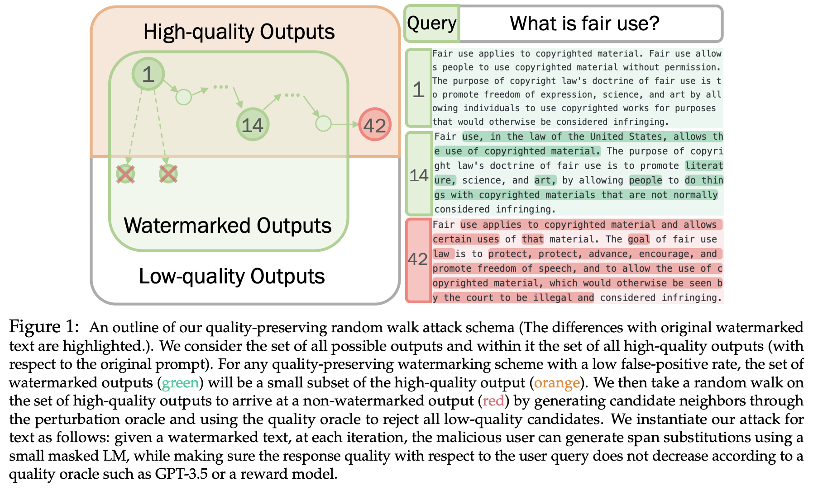

# Watermarks in the Sand: Impossibility of Strong Watermarking for Generative Models

[](#python)
[](https://opensource.org/licenses/MIT)

An official PyTorch implementation of [Watermarks in the Sand: Impossibility of Strong Watermarking for Generative Models](https://arxiv.org/abs/2311.04378).
We experiment with three watermark frameworks for larage language models - [UMD](https://arxiv.org/abs/2301.10226), [EXP](https://arxiv.org/abs/2307.15593), and [Unigram](https://arxiv.org/abs/2306.17439).

## Introduction
Watermarking generative models consists of planting a statistical signal (watermark) in a model's output so that it can be later verified that the output was generated by the given model. A strong watermarking scheme satisfies the property that a computationally bounded attacker cannot erase the watermark without causing significant quality degradation. In this paper, we study the (im)possibility of strong watermarking schemes. We prove that, under well-specified and natural assumptions, strong watermarking is impossible to achieve. This holds even in the private detection algorithm setting, where the watermark insertion and detection algorithms share a secret key, unknown to the attacker. To prove this result, we introduce a generic efficient watermark attack; the attacker is not required to know the private key of the scheme or even which scheme is used. Our attack is based on two assumptions: (1) The attacker has access to a "quality oracle" that can evaluate whether a candidate output is a high-quality response to a prompt, and (2) The attacker has access to a "perturbation oracle" which can modify an output with a nontrivial probability of maintaining quality, and which induces an efficiently mixing random walk on high-quality outputs. We argue that both assumptions can be satisfied in practice by an attacker with weaker computational capabilities than the watermarked model itself, to which the attacker has only black-box access. Furthermore, our assumptions will likely only be easier to satisfy over time as models grow in capabilities and modalities. We demonstrate the feasibility of our attack by instantiating it to attack three existing watermarking schemes for large language models: Kirchenbauer et al. (2023), Kuditipudi et al. (2023), and Zhao et al. (2023). The same attack successfully removes the watermarks planted by all three schemes, with only minor quality degradation.

Check our [paper](https://arxiv.org/abs/2311.04378) for more details.




## Quick start

```python
python attack.py --query your_query --reponse your_watermarked_response
```

## Citation 
If you find this repo useful, please consider citing: 
```
@misc{zhang2023watermarks,
      title={Watermarks in the Sand: Impossibility of Strong Watermarking for Generative Models}, 
      author={Hanlin Zhang and Benjamin L. Edelman and Danilo Francati and Daniele Venturi and Giuseppe Ateniese and Boaz Barak},
      year={2023},
      eprint={2311.04378},
      archivePrefix={arXiv},
      primaryClass={cs.LG}
}
```